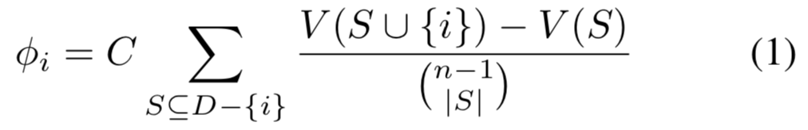
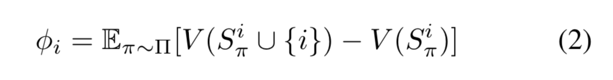
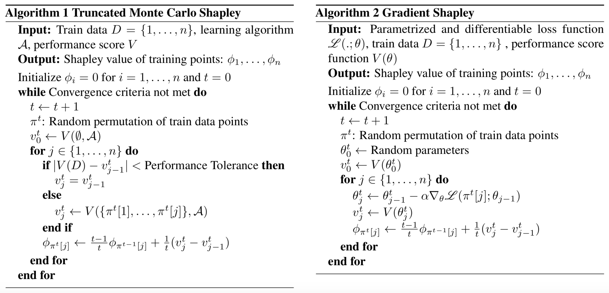
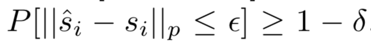
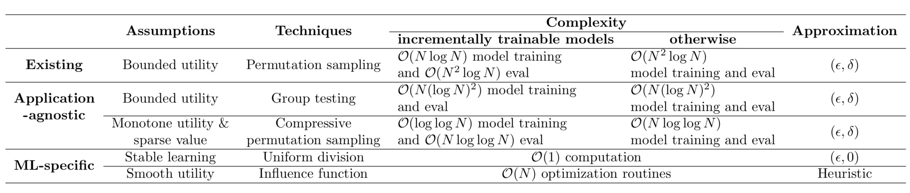
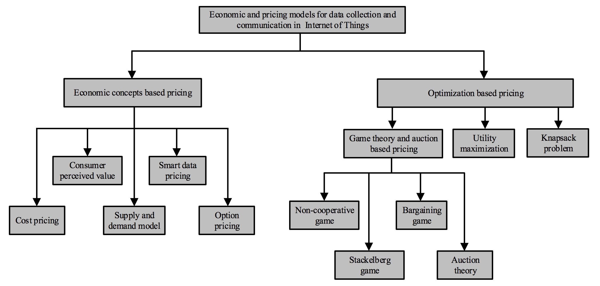

# Data Shapley Valuation

Here are papers about data point valuation. About [Shapley Value](https://www.rand.org/content/dam/rand/pubs/research_memoranda/2008/RM670.pdf).

## Data Shapley: Equitable Valuation of Data for Machine Learning

[pdf](http://proceedings.mlr.press/v97/ghorbani19c/ghorbani19c.pdf)

This work develops Monte Carlo and gradient-based methods to efficiently estimate data Shapley values.

### Points

It's hard to define a universal value for data. Instead, the value of each datum depend on the learning algorithm and the performance metric.

### Methods

Principled: value of a data point $d_i$ is defined on the average of performance change after adding $d_i$ to any subset:

It requires n! calculations

They tackle this by monte-carlo sampling until the average has empirically converged: 

> First, we sample a random permutations of data points. Then, we scan the permutation from the first element to the last ele- ment and calculate the marginal contribution of every new data point. Repeating the same procedure over multiple Monte Carlo permutations, the final estimation of the data Shapley is simply the average of all the calculated marginal contributions.

They also propose approximation to get the performance metric V.

### Applications

Acquiring new data

detect label noise (the mislabeled examples to be among the lowest even nagative valuable points)

## Towards Efficient Data Valuation Based on the Shapley Value

[pdf](https://arxiv.org/pdf/1902.10275.pdf)

This paper proposes another efficient way to approximate shapley value of data points.

The approximation error for Shapley value is defined:

The table of the approximations. Note that complexity for the first 3 three rows means full-model trainning.

### Methods

**Permutation Sampling** : Random sampling

**Group Testing-Based Approach**: It first estimates the Shap- ley differences and then derives the SV from the Shapley differences by solving a feasbility problem.

**Exploiting the Sparsity of Values**: They find that most of values are concentrated around its mean and only a few data points have significant values. Thus, through compressive sensing, the sparse signal s can be recovered with far fewer measurements y = As than the length of the signal, where A is a random Bernoulli matrix.

**Stable Learning Algorithms**: require the model to train with a stable learning algorithm, then the shapley value difference would have an upper bound.

**Heuristic Based on Influence Functions**: use influence functions instead of re-training the model for methods above

### Toughts

This is a paper that's relatively theoretically complete. It discuss different approximations for Shapley value. Also combine the Shapley value with influence functions to further lower the complexity.

## A BRIEF SURVEY OF DATA PRICING FOR MACHINE LEARNING

[Pdf](https://aircconline.com/csit/papers/vol10/csit100209.pdf)

Other parts are about data pricing in industries, blockchains even.

Two Categories for Data Pricing:

- based on classic economic theory
- based on game theory

There are also works on model pricing (Towards Model-based Pricing for Machine Learning in a Data Marketplace). To give prices to sell models directly.

According to this survey,c pricing data point in the training set w.r.t. a specific model seems a very small part of the data pricing.

This paper link to another survey on data pricing for Internet of Things: [Data Collection and Wireless Communication in Internet of Things (IoT) Using Economic Analysis and Pricing Models: A Survey](https://arxiv.org/pdf/1608.03475.pdf)

## AN EMPIRICAL AND COMPARATIVE ANALYSIS OF DATA VALUATION WITH SCALABLE ALGORITHMS

[Pdf](https://arxiv.org/pdf/1911.07128.pdf)

This paper proposed a method that approximates the model via a K-nearest neighbor (KNN) classifier, which has a locality structure that can lead to efficient Shapley value calculation.

### Methods

They experimented whether the valuation given by shapley value is reasonable through 2 experiments: 

> one focuses on the predictive power of a data value measure, studying whether it is indicative of a training point’s contribution to some random set; the other focuses on the ability of a data value to discriminate “good” training points from “bad” ones for privacy-preserving models. We consider leave-one-out error as a simple baseline data value measure and investigate the advantage of the Shapley value in terms of the two above performance metrics.

The representation of each example is given by the second-last layer of the model. Then a KNN is trained with the representation as the input.

The experiments seem to discover the use of shapley valuation like what's done in the "influence functions" paper.