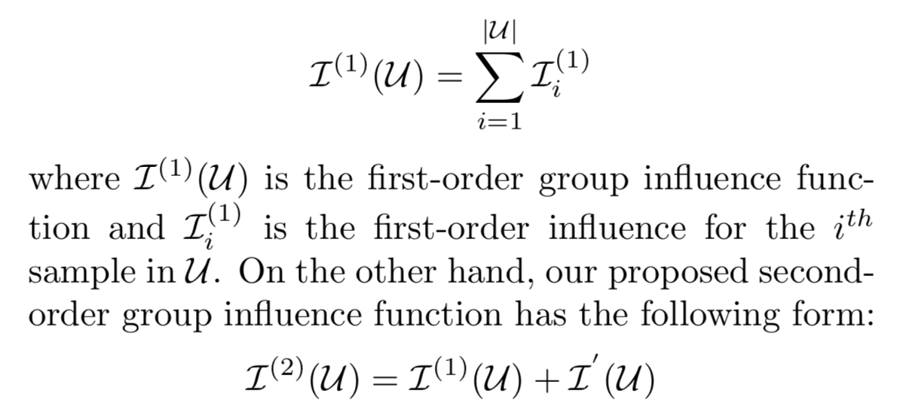

# Data Points Selection

The followings are the papers related to data points selection:

## Understanding Black-box Predictions via Influence Functions

[Pdf](https://arxiv.org/abs/1703.04730)

It studied the influence of a data point by removing it and seeing how the parameters of the model changes. (Replacing a data point can be divided into 2-step: remove data point a, add data point b). The methods they adapt from are influence functions, they efficiently approximate influence functions using second-order optimization techniques so that they can be perform good on non-differentiable, non-convex models.

### Methods

The influence of upweighting a data point z, removing it = upweight $-\frac{1}{n}$ of the formula below.

 where H is the Hessian and L is the loss

Perturbing it only works for continuous perturbations. The formulas for "the influence of upweighting/removing/perturbing z on the loss at a test point $z_{test}$ " can be found in the paper.

Efficient approximation to avoid calculating $H_\theta^{-1}$: use Hessian-vector products to replace it.

### Applications

Finding data points in the training data for a given example can be applied to many tasks.

> 1. Understanding the model: by telling us the training points “responsible” for a given prediction, influence functions reveal insights about how models rely on and extrapolate from the training data.
> 2. Adversarial training examples: can be used to craft adversarial *training* images that are similarly visually- indistinguishable and can flip a model’s prediction on a separate test image.
>
> 3.  Debugging domain mismatch: identify the training examples most responsible for the mismatch errors in test set,
> 4. Fixing mislabeled examples: we measure the influence of zi with $\mathcal I_{up,loss}(zi, zi)$.

### Limitations

The principled metric is still restricted. The approximation is still slow.

The applications of it is based on the one tool: find the most influencial data point for test data i.

## On the Accuracy of Influence Functions for Measuring Group Effects

[pdf](http://papers.nips.cc/paper/8767-on-the-accuracy-of-influence-functions-for-measuring-group-effects)

The influence functions are based on a first-order Taylor approximation that is guaranteed to be accurate for sufficiently small changes to the model, and so are commonly used to study the effect of individual points in large datasets. This work studies whether this approximation can be accurate when it comes to a group of data points.

The **absolute value** is not accurate, but the **values arrary** of groups correlates well with the real effects.

The predicted effect tends to *underestimate* the actual effect: can be approximate through effects by influence functions -> one-step Newton approximation -> actual effects.

Note that this actual effect is given by re-training the model. The size of subsets is ranging from 0.25% to 25%. The constructing of groups is as follows:

1) points that share feature values; 

2) points that cluster on their features or 3) on their gradients

4) random points within the same class; 

5) random points from any class. 

6) points with large positive and 7) negative influence on the test loss.

## Second-Order Group Influence Functions for Black-Box Predictions

[pdf](https://arxiv.org/abs/1911.00418)

This paper adds a second-order term to represent the interactive information in the group of data points.(cross dependencies)

## RelatIF: Identifying Explanatory Training Examples via Relative Influence

[pdf](https://arxiv.org/pdf/2003.11630.pdf)

> One shortcoming of influence functions is that the training examples deemed most “influential” are often outliers or mislabelled, making them poor choices for explanation.

RelatIF considers the local influence that an explanatory example has on a prediction relative to its global effects on the model.

### Methods

They hypothesize that influence functions often select outliners and mislabelled data point because they didn't have <u>constraint</u> on the re-weighted model.

RelatIF quantifies changes in loss subject to constraints on how the model may change, which is equivalent to constraining the change in the Kullback-Leibler (KL) divergence between the original and re-weighted model.

## Representer Point Selection for Explaining Deep Neural Networks

[Pdf](https://arxiv.org/abs/1811.09720)

> We show that we can decompose the pre-activation prediction of a neural network into a linear combination of activations of training points, with the weights corresponding to what we call representer values (positive/negative values have literal meaning)

### Methods

It splits neural networks into 3 parts: 

- Softmax (activation)
- Last layer before softmax activation (parameters)
- All the other layers (parameters)

Decomposing Neural Networks into a linear combination.

When only the top layer of a neural network is trained with L2 regularization, the obtained model parameters can be specified as a linear combination of the post-activation values of the training points at the last layer.

They also proposed methology to generate representers for NNs trained with L2 regularization or well-trained NNs.

## Estimating Training Data Influence by Tracking Gradient Descent

[Pdf](https://arxiv.org/pdf/2002.08484.pdf)

This paper calculate the reduction of the loss in the training procedure when a training example $z$ is utilized when updata one training example at one step.

They proposed first-order approximation under the circumstance where test data is unseen during the training procedure.

This can also scale to mini-batch training by regarding influence of a mini batch is equally contributed by each example in it.

### Other papers

[Influential Sample Selection: A Graph Signal Processing Approach](https://www.semanticscholar.org/paper/Influential-Sample-Selection%3A-A-Graph-Signal-Anirudh-Thiagarajan/16eb1cd4c2545078af4b88c248c3b42ba40be794)

[Explaining Black Box Predictions and Unveiling Data Artifacts through Influence Functions](https://www.semanticscholar.org/paper/Explaining-Black-Box-Predictions-and-Unveiling-Data-Han-Wallace/0696ad8beb0d765973aa5cdbc6e118889d3583b0)

[Interpreting Deep Models through the Lens of Data](https://www.semanticscholar.org/paper/Interpreting-Deep-Models-through-the-Lens-of-Data-Mercier-Siddiqui/4440ca0aa4fc3ec3c98dce6d5dbd6b2395c8efa9)

[Using machine teaching to identify optimal training-set attacks on machine learners](https://scholar.google.com/scholar?cluster=16406613591482521678&hl=en&as_sdt=0,5&sciodt=0,5)

